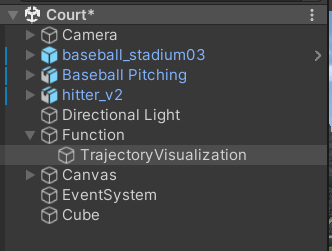

# Baseball-project
Make sure hierarchy's function is open, and at least one functoin is open.

# Function-Trajectories Visualization
press("n") to show the next trajectory

press("a") to show all the trajectories you input

Display1

Data:
coordinate(x, y, z)

